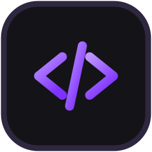

<div align="center">



# acyka · sdk

**The API, its documentation, and client libraries for six languages.**

Everything here is generated from, or written against, one file.

[**dev.acyka.cc →**](https://dev.acyka.cc)

</div>

---

Everything here is generated from or written against one file: **`openapi.json`**,
which comes out of the server itself. The server writes it from
annotations that sit on the handlers, and a test there drives every path in it
against the real router — so a route that changes shape changes this file in the
same commit, and a path that does not exist cannot be described.

That is the whole reason six libraries are a build step rather than a
maintenance problem. Six hand-written clients reading one prose document start
disagreeing with it, and with each other, in the first month.

The same document is served at
**[`https://api.acyka.cc/api/v1/openapi.json`](https://api.acyka.cc/api/v1/openapi.json)**,
without a token — so a language none of the six covers is `openapi-generator`
away, and `contract.yml` here can ask the running server what shape it is in
today without holding a credential for anything. The committed file is the half a
release pins to; the url is the half somebody who has not got this repository can
read.

```
openapi.json          the contract, read off the live server by CI
tools/                the generator: one reader, six emitters
apps/docs             dev.acyka.cc — the guides, the reference, the playground
packages/typescript   @acyka/api
packages/python       acyka
packages/rust         acyka
packages/kotlin       cc.acyka:acyka
packages/csharp       Acyka
packages/cpp          acyka, header-only
```

## What is generated and what is not

**Generated:** the types, and one typed method per operation. Those are the parts
that are a mechanical function of the contract, and the parts a human writing
them by hand gets subtly wrong in six different ways.

One thing the reader will not guess at: a schema that is a genuine union of two
shapes. `oneOf` with a single non-null branch is unwrapped — that is how utoipa
spells an optional field whose type is a schema, and reading only the scalar
form (`"type": ["integer", "null"]`) had every nullable reference come out as
`unknown`, `Any`, `serde_json::Value` and `JsonElement` in the six clients. A
real union stays `unknown`, because guessing at it would be worse than saying so.

**Written by hand, once per language:** the transport, and everything that makes
a client pleasant rather than merely correct —

- **the OAuth flows.** All four: the authorization code with PKCE, the refresh
  that rotates, `client_credentials` for a process with no person in it, and the
  device flow for something with no browser.
- **the token that renews itself.** An access token lives an hour. A library that
  makes its caller notice that is a library whose callers all write the same
  retry loop, slightly differently.
- **backing off on the numbers the server sends.** Every answer carries
  `X-RateLimit-Remaining` and `X-RateLimit-Reset`, and the 429 carries
  `Retry-After`. A client that reads them waits exactly as long as it must; one
  that guesses either hammers the door or sleeps for no reason.
- **paginators.** `limit`/`offset` and a `total` is a loop everybody writes and
  somebody gets wrong at the last page.
- **one error type per refusal.** The server answers `{"message": "errors.x"}`
  where `errors.x` is a phrase name and never a sentence, because one screen can
  be read in five languages. That makes the set enumerable, so each language gets
  a real exception type per name instead of string matching.
- **verifying a webhook.** Constant-time, with the timestamp checked, because
  every one of these that is written by hand is written wrong once.

## Building it

```bash
bun install
bun run generate      # openapi.json -> the generated half of all six
bun run check         # every library, in its own toolchain
bun test              # the reader, and the TypeScript client
```

`bun run check` drives all six through the root workspace, each with the tools
its own language wants:

| | needs on the machine |
|---|---|
| typescript | nothing but bun |
| python | `python3 -m venv .venv && .venv/bin/pip install httpx pytest` in `packages/python` |
| rust | a stable toolchain |
| kotlin | a JDK 17 or newer |
| csharp | the .NET SDK |
| cpp | cmake, a C++17 compiler, libcurl |

**Two lockfiles, on purpose.** `apps/docs` is deliberately *not* a member of the
root workspace: it is the one thing here that depends on `@cyka/ui`, which is a
**private package** in the group's registry, and a workspace member's dependency
is everybody's `bun install`. Split out, the six libraries install and test for anybody —
including somebody outside the org sending a patch to the Python client, which is
most of the reason to publish source at all.

```bash
bun run docs          # the site, on :5173
bun run docs:check
bun run docs:build
```

## The site

`apps/docs` is [dev.acyka.cc](https://dev.acyka.cc): the guides, a reference page
per operation, and a playground that holds a real token.

Three things about it are load-bearing and none of them is visible when broken.

**The contract never reaches the browser.** `openapi.json` is 160 KB and the
reader that flattens it is not small either; both live under `$lib/server`, so
SvelteKit refuses at build time if a component imports them. Every loader is
`+page.server.ts`, `slug()` is four lines in a leaf module of its own, and the
rail arrives as data from `+layout.server.ts`. `check.yml` measures the client
bundle and fails over a megabyte, because the site rendered perfectly the day it
was eleven.

**Shiki colours on the server.** A loader hands each page `{ code, html }`. The
highlighter is a megabyte of grammars.

**The frame is written rather than taken from the kit.** `@cyka/ui` exports a
`Shell` of the right shape, but its page is 860px wide and a reference table is
wider than that. Everything else is the kit's: the tokens, the motion, the fonts
and every control.

## CI

| workflow | when | what |
|---|---|---|
| `check.yml` | every push and pull request | the six libraries in their own toolchains, and the site — including `bun run generate` leaving a clean tree, which is the whole assertion that the committed clients match the contract |
| `contract.yml` | daily, and on demand | asks the live server for its document, checks the six OAuth addresses against what it advertises, regenerates, and opens one pull request if anything moved |
| `deploy.yml` | a push that touches the site | builds the image, pushes it to ghcr, tells the box to pull it |
| `publish.yml` | a `v*` tag | npm, PyPI, crates.io, Maven Central, NuGet, and a tarball of the C++ headers |

These run on GitHub's own runners, which is the opposite of the answer
`acyka/api` reached — and for two reasons. Its three self-hosted runners
are registered to *that* repository rather than to the organisation, so a job
here queues for a machine that will never take it; and the hosted image already
carries every toolchain this needs, while the warm cargo `target/` that makes
the other repo's build worth a dedicated box has no equivalent here.

### The secrets it needs

Everything under `packages/` is checked with nothing but the `GITHUB_TOKEN` a run
already has. The rest are per-registry and per-destination, and a workflow that
needs one it has not got says so by name rather than failing at the first command
that quietly did nothing:

| secret | wanted by |
|---|---|
| `CYKA_NPM_TOKEN` | the `docs` job and the image build — the group's `npm read` deploy token, which is how `@cyka/ui` is installed |
| `SSH_HOST`, `SSH_USER`, `SSH_KEY` | `deploy.yml` — the same three `acyka/api` deploys with |
| `NPM_TOKEN` | `publish.yml` |
| `PYPI_TOKEN` | `publish.yml` |
| `CARGO_REGISTRY_TOKEN` | `publish.yml` |
| `MAVEN_CENTRAL_USERNAME`, `MAVEN_CENTRAL_PASSWORD`, `MAVEN_GPG_KEY`, `MAVEN_GPG_PASSWORD` | `publish.yml` — Central refuses an unsigned artifact |
| `NUGET_API_KEY` | `publish.yml` |

### Releasing

The version lives six times, because six build systems have no shared notion of
one. `agreed` in `publish.yml` runs `.github/scripts/versions.ts` against the tag
and refuses the whole run unless all six say exactly it — publishing five of six
is worse than publishing none, since the version is then taken in five registries
and the fix is a patch bump rather than a re-run.

```bash
bun .github/scripts/versions.ts          # what the six say now
bun .github/scripts/versions.ts 1.1.0    # would that tag be accepted
```

### The addresses that are not in the contract

`/oauth2/token` is RFC 6749's endpoint — form-encoded, shaped by a spec rather
than by us — so it is not in `openapi.json`, the generator never sees it, and the
constant is hand-written six times. All six shipped pointing at
`https://api.acyka.cc/api/oauth2/token`, which is a 404, and nothing here could
have noticed. Three separate facts had to be right at once: only `acyka.cc`
strips an `/api` prefix, every endpoint hangs off the **issuer** rather than off
the api's host, and the issuer is `https://acyka.cc`.

So they are checked against the server rather than reviewed:

```bash
bun .github/scripts/endpoints.ts                    # against production
bun .github/scripts/endpoints.ts http://localhost:3001
```

A client should really read `/.well-known/openid-configuration` itself, which is
what the guide says and what the playground does. The constants exist to save the
common case a round trip.

## Releases

Every library is versioned together and published from one tag, so
`acyka@1.4.0` means the same contract in all six languages. They go to the
registry each language already uses:

| language | package | registry |
|---|---|---|
| TypeScript | `@acyka/api` | npm |
| Python | `acyka` | PyPI |
| Rust | `acyka` | crates.io |
| Kotlin | `cc.acyka:acyka` | Maven Central |
| C# | `Acyka` | NuGet |
| C++ | header-only | a tarball on the release page, or CMake `FetchContent` |

Releasing them is [`RELEASING.md`](RELEASING.md).

## Contributing

The contract is not edited here: `openapi.json` is read off the live server,
and the six libraries are `bun run generate`. So a pull request that changes a
generated file by hand will be reverted by the next generator run — what is
worth changing is in `tools/` (the emitters) and in the hand-written transport
each language carries, which is everything that makes a client pleasant rather
than merely correct.

If the document itself is wrong — a shape that does not match what the server
actually sends, a route that is missing — open an issue with the request and
the response you saw. That is a bug in the api, and this repository is where it
gets noticed.

## Licence and support

The api it speaks to is [acyka](https://acyka.cc), and using it needs nothing
but a client id you register at
[acyka.cc/settings/applications](https://acyka.cc/settings/applications). The
reference, the playground and the guides are at
[**dev.acyka.cc**](https://dev.acyka.cc); `openapi.json` is served without a
token at
[`api.acyka.cc/api/v1/openapi.json`](https://api.acyka.cc/api/v1/openapi.json),
so a language none of the six covers is one `openapi-generator` away.

<div align="center">
<sub>One contract, six libraries, no hand-written drift.</sub>
</div>
